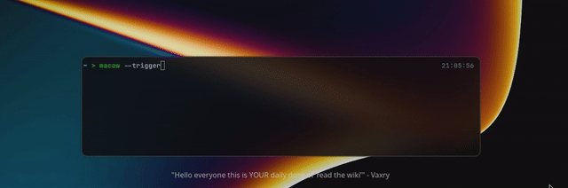
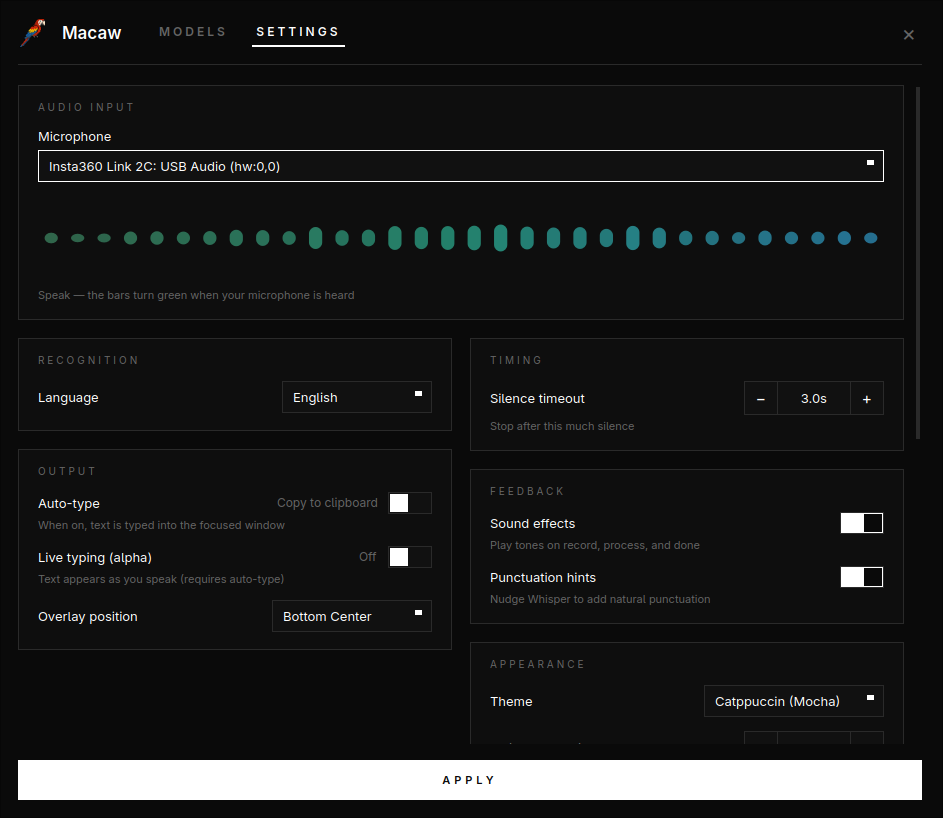
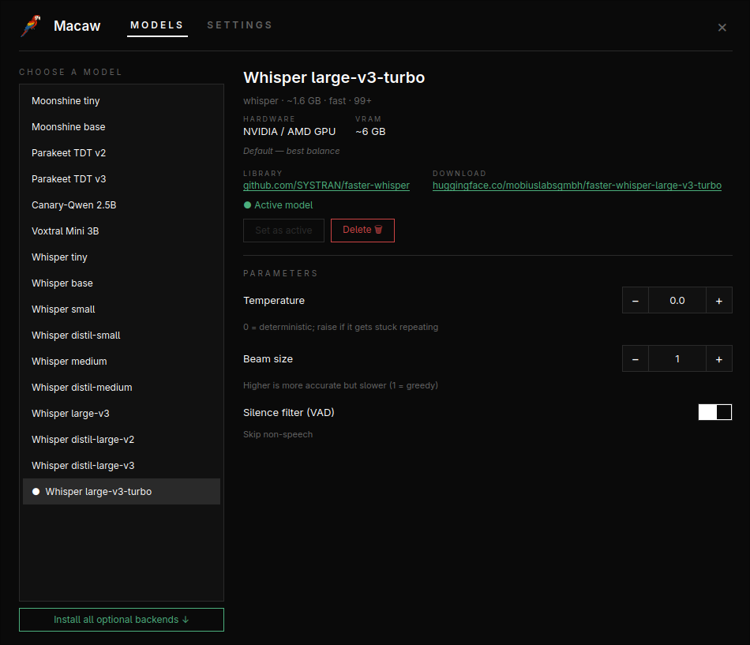
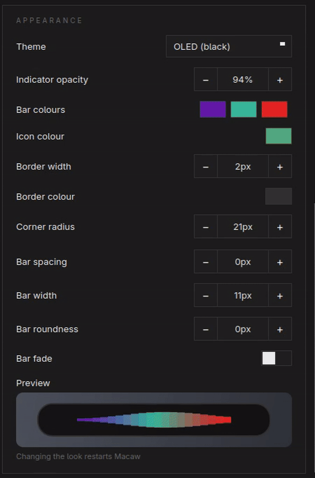

<!-- trunk-ignore-all(markdownlint/MD033) -->
<!-- trunk-ignore(markdownlint/MD041) -->
<div align="center">
  

  <h1>Macaw</h1>

  <h3>Talk, and Macaw types it. All on your own machine.</h3>

  <p><b>Local-first&nbsp;&nbsp;•&nbsp;&nbsp;Offline by default&nbsp;&nbsp;•&nbsp;&nbsp;No subscription&nbsp;&nbsp;•&nbsp;&nbsp;Wayland &amp; X11&nbsp;&nbsp;•&nbsp;&nbsp;Windows (beta)</b></p>

[![stars-badge-img]][stars-badge]
[![release-badge-img]][release-badge]
[![downloads-badge-img]][downloads-badge]
[![python-badge-img]][python-badge]
[![license-badge-img]][license-badge]

  <p>
    <a href="https://macaw.osyna.com/"><b>Website</b></a>
    &nbsp;•&nbsp;
    <a href="https://github.com/Osyna/Macaw/releases/latest"><b>Download</b></a>
    &nbsp;•&nbsp;
    <a href="https://github.com/Osyna/Macaw/issues/new"><b>Report a bug</b></a>
  </p>
</div>

<p align="center">
  
  <br>
  
</p>

Press a hotkey, say your sentence, and it drops straight into whatever you're typing in, or onto your clipboard. Macaw runs [faster-whisper](https://github.com/SYSTRAN/faster-whisper) on your GPU or CPU, sits quietly in the tray, and works across Wayland (Hyprland, Sway, KDE, GNOME) and X11. Nothing gets uploaded. Nothing phones home.

<details>
<summary><b>Table of contents</b></summary>

- [Why Macaw](#why-macaw)
- [Features](#features)
- [Models](#models)
- [Install](#install)
- [Usage](#usage)
- [Configuration](#configuration)
- [How it works](#how-it-works)
- [Adding a model](#adding-a-model)
- [Troubleshooting](#troubleshooting)
- [Releasing](#releasing)
- [Contributing](#contributing)
- [License](#license)

</details>

## Why Macaw

- 🔒 **Local by default.** Every local engine runs fully on your machine — no account, no round-trip. The two GPT-4o cloud models are strictly opt-in, with your own key.
- 🆓 **Free and open.** MIT-licensed, and the models are open too. No subscription, no per-minute meter.
- 🐧 **Made for Linux.** Wayland or X11, a tray app with one hotkey to fire it. A native win64 build (beta) covers Windows too.
- 🔁 **Swap the brain.** Start on Whisper, move to Parakeet, Voxtral, Moonshine, or the featherweight sherpa-onnx CPU models whenever you feel like it.
- ⚡ **Uses your GPU.** CUDA when it's there, CPU when it isn't, and nothing to wire up either way.

## Features

Macaw lives in the tray: one window for everything, and a recording overlay you can make your own.

<table>
<tr>
<td width="50%" valign="middle">

### Everything in one window

Settings, a live microphone meter, and a full model manager in one tray window — pick your mic, language, output mode, and overlay position, and watch the bars light up green as it hears you.

</td>
<td width="50%">
  
</td>
</tr>
<tr>
<td width="50%" valign="middle">

### Swap the brain, live

Two dozen models across seven engines — Whisper, Moonshine, Parakeet, Canary-Qwen, Voxtral, sherpa-onnx, and OpenAI cloud. Install any local one on demand into its own sandbox (or drop in an OpenAI key for the cloud models), tune temperature, beam size, and the VAD filter, and set the active model without touching a config file.

</td>
<td width="50%">
  
</td>
</tr>
<tr>
<td width="50%" valign="middle">

### Make the overlay yours

The recording indicator is fully themeable — opacity, bar colours, icon colour, border, per-corner radius (linked or independent), and the equaliser's spacing, width, roundness, and fade — with a live preview as you tweak.

</td>
<td width="50%">
  
</td>
</tr>
</table>

**Also in the box:**

- **One hotkey** to start and stop — and it auto-stops when you go quiet.
- **Type or clipboard** — paste straight into the focused window, or just copy.
- **Punctuation hints** per language, so commas and periods land where you'd expect them.
- **Curated model cards** — star ratings, pros/cons, and minimum vs recommended hardware for every model, so you pick right the first time.
- **Live typing (alpha)** — words appear as you speak, once two passes agree on them.
- **Smart paste** — picks ydotool, wtype, or xdotool for you, and falls back per window when one misbehaves.
- **Sound cues** for recording, processing, and done.

## Models

Whisper is built in. The rest install on demand from the Model Manager (`macaw --models`), each in its own sandbox so nothing clobbers your main setup. Pick the one that fits your hardware and languages.

| Model | Project | Languages | Download | Runs on | Install |
|-------|---------|-----------|----------|---------|---------|
| Whisper `tiny` → `large-v3-turbo` | [faster-whisper][faster-whisper] · [OpenAI Whisper][whisper] | 99+ | 75 MB – 3 GB | CPU or GPU | built in |
| Moonshine `tiny` / `base` | [Useful Sensors Moonshine][moonshine] | English | ~30–60 MB | CPU | `macaw[moonshine]` |
| Parakeet TDT `v2` / `v3` | [NVIDIA NeMo][nemo] | English / 25 | ~2.5 GB | NVIDIA GPU | `macaw[nemo]` |
| Canary-Qwen 2.5B | [NVIDIA NeMo][nemo] | English | ~5 GB | NVIDIA GPU | `macaw[nemo]` |
| Voxtral Mini 3B | [Mistral Voxtral][voxtral] · [Transformers][transformers] | 13 | ~6 GB | NVIDIA GPU | `macaw[voxtral]` |
| Zipformer · Paraformer · Parakeet (ONNX) | [sherpa-onnx][sherpa-onnx] | English · Chinese · 25 | ~26 MB – 660 MB | CPU | `macaw[sherpa]` |
| GPT-4o Transcribe · mini | [OpenAI][openai-stt] | 99+ | cloud (API key) | Cloud | `macaw[openai]` |

The default is `large-v3-turbo`: 99+ languages, about 1.6 GB, and the best speed-to-accuracy trade-off on a GPU. On a laptop with no GPU, `base` or `distil-small.en` keep things snappy.

**Offline vs cloud.** sherpa-onnx and every other local engine run entirely on your machine; the GPT-4o models are cloud APIs — set an OpenAI key in the Model Manager (or `OPENAI_API_KEY`) to use them.

## Install

Every method gives you the Macaw app (tray + Settings/Models windows + overlay). Set a global shortcut in Settings, or bind `macaw --trigger` to a key yourself.

| Method | Best for | Command |
|--------|----------|---------|
| deb / rpm | Debian, Ubuntu, Fedora, openSUSE | grab it from [Releases](https://github.com/Osyna/Macaw/releases/latest) |
| Install script | everything else | `curl -fsSL https://raw.githubusercontent.com/Osyna/Macaw/main/install.sh \| bash` |
| AppImage | no install | grab it from [Releases](https://github.com/Osyna/Macaw/releases/latest), `chmod +x`, run |
| NSIS installer | Windows 10/11 (beta) | `Macaw_<version>_x64-setup.exe` from [Releases](https://github.com/Osyna/Macaw/releases/latest) |

First, the system bits Macaw talks to:

```sh
# Arch
pacman -S wl-clipboard wtype ydotool portaudio

# Ubuntu / Debian
apt install wl-clipboard wtype ydotool libportaudio2
```

On Wayland, `ydotool` is the safest pick for type mode: it handles native Wayland apps and XWayland alike. `wtype` only covers native Wayland windows. On X11, `xdotool` is enough. You'll also need Python 3.10+.

### Install script

```sh
curl -fsSL https://raw.githubusercontent.com/Osyna/Macaw/main/install.sh | bash
```

It downloads the latest AppImage to `~/.local/bin`, adds the desktop launcher and icon, and offers to set up input-group access for the evdev hotkey and ydotool. Run `install.sh uninstall` to remove it again.

### AppImage / deb / rpm

Each bundle ships the UI **and** the speech engine (Python is embedded — no system Python needed). Whisper is built in; every other backend installs on demand from the Model Manager into its own sandbox under `~/.local/share/macaw/backends/`, including the GPU ones (CUDA wheels and all). On Wayland the overlay anchors via wlr-layer-shell (`gtk-layer-shell`; the deb/rpm pull it in, and Hyprland/Sway/KDE support it out of the box).

### Windows (beta)

Run `Macaw_<version>_x64-setup.exe` from the [latest release](https://github.com/Osyna/Macaw/releases/latest).

What's different on Windows:

- **Hotkey** uses the native `RegisterHotKey` API — set it in Settings as usual (no `input` group, no evdev).
- **Typing** uses `SendInput` — no ydotool/wtype/xdotool needed.
- **Models:** Whisper, sherpa-onnx, Moonshine, Voxtral, and the GPT-4o cloud models work; **NeMo (Parakeet GPU / Canary-Qwen) is Linux-only.** `uv.exe` ships with the engine, so sandboxed installs from the Model Manager just work.
- **Autostart:** flip **Settings → Start at login**.
- Config lives at `%USERPROFILE%\.config\macaw\config.yaml`.

### CLI-only install (no UI)

```sh
uv tool install "macaw @ git+https://github.com/Osyna/Macaw"
macaw --download large-v3-turbo    # fetch a model
macaw --run                        # headless engine (hotkey + overlay-less dictation)
```

That gives you the engine and the `macaw` CLI without the desktop app — dictation still lands in your clipboard or focused window. Backends install from `macaw --setup`, or as extras: `macaw[sherpa]`, `macaw[moonshine]`, `macaw[nemo]`, `macaw[voxtral]`, `macaw[openai]`, `macaw[cuda]`.

## Usage

| Command | What it does |
|---------|--------------|
| `Macaw` (app) | Tray + Settings/Models + recording overlay. Spawns and owns the engine. |
| `macaw --run` | The engine, headless — for CLI-only installs. |
| `macaw --trigger` | Toggles recording in the running engine. Bind this to a key. |
| `macaw --status` / `--stop` | Probe / stop the running engine. |
| `macaw-cli` | Standalone push-to-talk in the terminal. No engine needed. |

### Hotkey setup

**Built-in (recommended).** Open **Settings → Global shortcut**, turn it on, click the field and press your combo — including `Super`/Meta combos, which Macaw captures straight from evdev so a Wayland compositor (Hyprland, etc.) can't swallow them. It's off by default, and the same shortcut works on X11 and every Wayland compositor with no per-desktop config. It needs read access to input devices; the installer already adds you to the `input` group for ydotool (log out and back in once after the first install). It only monitors input, so your combo still reaches other apps.

**Or bind it yourself.** Prefer your compositor's own keybinds? Point one at `macaw --trigger`:

```conf
# Hyprland (hyprland.conf)
bind = , F9, exec, macaw --trigger

# Sway (config)
bindsym F9 exec macaw --trigger
```

On KDE or GNOME, add a custom keyboard shortcut that runs `macaw --trigger`.

## Configuration

Settings live behind the tray icon. They're saved to `~/.config/macaw/config.yaml` (or `$XDG_CONFIG_HOME/macaw/config.yaml`), and you can edit the file by hand:

```yaml
device_index: null          # microphone index (null = system default)
language: en                # Whisper language code
model: large-v3-turbo       # see the Model Manager for the full list
output_mode: clipboard      # "clipboard" or "type"
silence_timeout: 3.0        # seconds of silence before it auto-stops
window_position: bottom_center
sound_enabled: true
punctuation_hints: true     # nudge Whisper toward natural punctuation
streaming: false            # live typing as you speak (alpha)
```


**Output modes.** In clipboard mode the text is copied and the overlay shows a checkmark. In type mode the overlay hides first, so it won't steal focus, then the text is pasted into whatever window was focused when you started.

**Punctuation hints.** When on, Macaw feeds Whisper a well-punctuated sentence in your language as the `initial_prompt`, which biases it toward commas, periods, and question marks. Works for English, French, German, Spanish, Italian, Portuguese, Dutch, Polish, Russian, Japanese, and Chinese.

**Live typing (alpha).** With type mode on, Macaw re-transcribes about once a second while you talk and types the words that two consecutive passes agree on. A final pass flushes the rest when you stop. It runs inference on a growing audio window, so it costs more GPU. Off by default.

## How it works

```
Macaw (Tauri app: tray, Settings/Models, overlay)
   |            \
   | spawns      \ WebSocket (JSON-RPC + events, 127.0.0.1, token-authed)
   v              \
macaw-engine  <----+          macaw --trigger --[ZMQ IPC]--> macaw-engine
   |
   +-- AudioCapture (sounddevice)
   +-- Transcriber (facade) --> macaw.stt backends
   +-- DesktopHelper (clipboard, paste, focus)
   +-- HotkeyListener (evdev / RegisterHotKey)
```

- The UI is a [Tauri](https://tauri.app) app; the engine is headless Python. The app spawns the engine and holds its stdin — if either dies, the other follows.
- CLI IPC is ZMQ REQ/REP over a Unix socket at `$XDG_RUNTIME_DIR/macaw.ipc` (TCP on Windows).
- The UI drives the engine over a local WebSocket: config, model management, recording state, live mic levels for the overlay bars.
- Audio is captured at 16 kHz mono with energy-based speech detection.
- Transcription runs through pluggable backends; the default is `large-v3-turbo` on faster-whisper with a Silero VAD filter.
- Pasting uses ydotool (evdev), wtype (Wayland virtual keyboard), or xdotool (X11), with XWayland detection on Hyprland.

`Transcriber` is a thin facade. It normalizes audio to mono float32 at 16 kHz and gates silence, then hands off to whichever backend the configured model points at. Whisper runs in-process; the others carry native dependency stacks that don't get along with the CUDA + faster-whisper environment, so each lives in its own isolated venv under `~/.local/share/macaw/backends/<extra>/`, driven by a sidecar worker (`stt/worker.py`) that swaps audio and text over a pipe. The Model Manager's Install button builds that venv for you, and nothing touches the main environment.

### Adding a model

Adding a model is two small files: a backend and a YAML entry.

```python
# src/macaw/stt/mybackend.py — the code (metadata lives in YAML, not here)
from macaw.stt.base import Backend
from macaw.stt.registry import register

@register
class MyBackend(Backend):
    key = "mybackend"                               # models bind to this key

    def load(self, model_path=None): ...            # load into memory
    def transcribe(self, audio, sample_rate=16_000) -> str: ...  # mono f32 16kHz
```

```yaml
# src/macaw/stt/models/mybackend.yaml — the catalog metadata
backend: mybackend            # matches Backend.key above; inherited by each model
models:
  - id: my-model
    label: My Model
    size: "~1 GB"
    speed: fast
    languages: EN
    hardware: "CPU / Any"
    vram: "—"
```

Import the module in `src/macaw/stt/__init__.py` so the class registers; the YAML is read at import. The model then shows up in the Model Manager with its hardware, VRAM, and size. If the backend's dependencies clash with the main environment, subclass `SubprocessBackend` instead (set `key` only) and add a loader to `stt/worker.py`; it installs into an isolated venv and runs out-of-process. See `tests/test_stt.py` for the contract.

## Troubleshooting

Engine logs are the app's stderr, prefixed `[engine]` — run `Macaw` (or the AppImage) from a terminal to watch them live.

**Type mode does nothing.** You need at least one paste tool (`ydotool`, `wtype`, or `xdotool`); watch the logs for "No paste tool available". For `ydotool`, the `ydotoold` daemon has to be running and your user needs access to `/dev/uinput`, usually via the `input` group.

**Text lands in the wrong window.** Macaw grabs the active window before it shows the overlay. Switch windows mid-recording and the text follows the original one. That's on purpose.

**No GPU acceleration.** Check CUDA with `python -c "import ctranslate2; print(ctranslate2.get_cuda_device_count())"`. A `0` means CUDA libraries aren't on your `LD_LIBRARY_PATH`, or you need the `[cuda]` extra.

**Second instance won't start.** Only one engine can hold the IPC socket; launching the app again just focuses the running instance.

**Electron apps miss the paste.** On Wayland, `wtype` sends virtual keyboard events some Electron apps read wrong. Macaw uses Shift+Insert instead of Ctrl+V for `wtype`, and prefers `ydotool`, which works everywhere.

## Releasing

Releases are built by CI whenever a `vX.Y.Z` tag is pushed: `release.yml` ships the wheel/sdist, the Linux Tauri bundles (AppImage/deb/rpm, engine embedded), and `SHA256SUMS`; `windows.yml` adds the NSIS installer.

Cut one in a single step. `make tag` bumps the version in `pyproject.toml` and `src-tauri/tauri.conf.json`, commits, and tags:

```sh
make tag VERSION=0.2.0
git push && git push origin v0.2.0
```

To refresh the AUR package after the release exists, run `packaging/aur/bump.sh 0.2.0` from an Arch checkout (it fetches the tag tarball, writes the `sha256` and `.SRCINFO`), then commit and push those to the macaw AUR repo.

## Contributing

Bug reports, ideas, and pull requests are all welcome. [Open an issue](https://github.com/Osyna/Macaw/issues/new) to start. Run `ruff check` and `python tests/test_stt.py` before you push, and keep changes focused.

## License

MIT. Use it, fork it, ship it.

## Acknowledgments

Macaw stands on a lot of good open-source work:

- [faster-whisper][faster-whisper] and [OpenAI Whisper][whisper] for the default engine
- [NVIDIA NeMo][nemo] for Parakeet and Canary-Qwen
- [Mistral Voxtral][voxtral] and Hugging Face [Transformers][transformers]
- [Useful Sensors Moonshine][moonshine] for the featherweight option
- [sherpa-onnx](https://github.com/k2-fsa/sherpa-onnx) (k2-fsa) for streaming ASR on plain CPUs
- [Tauri](https://tauri.app), [sounddevice](https://python-sounddevice.readthedocs.io/), and [uv](https://docs.astral.sh/uv/)

## Star history

If Macaw saves you some typing, a ⭐ helps other people find it.

<a href="https://star-history.com/#Osyna/Macaw&Date">
  
</a>

<!-- Badges -->

[stars-badge-img]: https://img.shields.io/github/stars/Osyna/Macaw?style=for-the-badge&color=e5322b
[stars-badge]: https://github.com/Osyna/Macaw/stargazers
[release-badge-img]: https://img.shields.io/github/v/release/Osyna/Macaw?style=for-the-badge&color=e5322b
[release-badge]: https://github.com/Osyna/Macaw/releases/latest
[downloads-badge-img]: https://img.shields.io/github/downloads/Osyna/Macaw/total?style=for-the-badge&color=f7b500
[downloads-badge]: https://github.com/Osyna/Macaw/releases
[python-badge-img]: https://img.shields.io/badge/python-3.10%2B-3776ab?style=for-the-badge
[python-badge]: https://www.python.org/
[license-badge-img]: https://img.shields.io/github/license/Osyna/Macaw?style=for-the-badge&color=666666
[license-badge]: LICENSE

<!-- Model & library links -->

[faster-whisper]: https://github.com/SYSTRAN/faster-whisper
[whisper]: https://github.com/openai/whisper
[moonshine]: https://github.com/usefulsensors/moonshine
[nemo]: https://github.com/NVIDIA/NeMo
[voxtral]: https://huggingface.co/mistralai/Voxtral-Mini-3B-2507
[transformers]: https://github.com/huggingface/transformers
[sherpa-onnx]: https://github.com/k2-fsa/sherpa-onnx
[openai-stt]: https://platform.openai.com/docs/guides/speech-to-text
